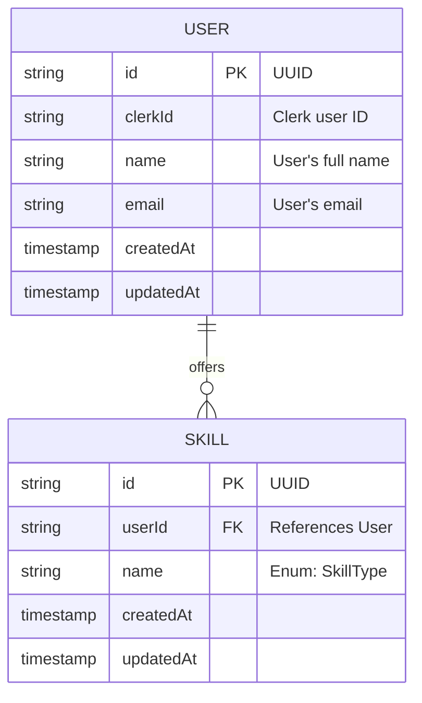

# 🔁 Skill Swap Platform

Welcome to the **Skill Swap Platform**, a full-stack web application built by **Team 1249** that empowers users to list their skills, browse other users, and swap skills seamlessly. Powered by Clerk authentication, Prisma ORM, and PostgreSQL, this platform fosters a community of skill-sharing with a sleek, modern interface.

---

## ✨ Features

- 🔐 **Secure Authentication**: Clerk-based user login and signup.
- 🧑 **User Profiles**: Editable profiles with name, email, and skills.
- 🛠️ **Skill Offering**: Multi-select form to add and update skills.
- 📂 **Dynamic Skill Listing**: Enum-based skill selection for consistency.
- 🗂️ **User Directory**: Browse all users and their offered skills.
- 🧠 **Backend**: Prisma ORM with PostgreSQL for robust data management.
- 🎨 **Styling**: Tailwind CSS for a responsive, modern UI.

---

## 📦 Tech Stack

| Category         | Tech                       |
|------------------|----------------------------|
| Framework        | [Next.js 14](https://nextjs.org) |
| Authentication   | [Clerk](https://clerk.dev) |
| ORM              | [Prisma 5](https://www.prisma.io) |
| Database         | PostgreSQL 16              |
| Styling          | Tailwind CSS 3             |
| Deployment       | Vercel (Recommended)       |

---

## 📊 Database Schema

The platform uses a simple schema with `User` and `Skill` tables, connected via a one-to-many relationship.



---

## 🛠️ Local Setup

### Prerequisites
- **Node.js**: v18 or higher
- **PostgreSQL**: v16, installed and running locally
- **Clerk Account**: API keys from [Clerk Dashboard](https://dashboard.clerk.dev)
- **npm**: v9 or higher

### 1. Clone the Repository

```bash
git clone https://github.com/team1249/skill-swap-platform.git
cd skill-swap-platform
```

### 2. Install Dependencies

```bash
npm install
```

### 3. Set Environment Variables

Create a `.env` file in the root directory:

```env
DATABASE_URL=postgresql://<username>:<password>@localhost:5432/skillswap
CLERK_SECRET_KEY=sk_xxxxxxxxxxxxxxxxxxxxxxxxxxxx
CLERK_PUBLISHABLE_KEY=pk_xxxxxxxxxxxxxxxxxxxxxxxxxxxx
```

> **Note**: Replace `<username>`, `<password>`, and `skillswap` with your PostgreSQL credentials and database name. Obtain Clerk keys from your [Clerk Dashboard](https://dashboard.clerk.dev).

### 4. Generate Prisma Client

```bash
npx prisma generate
```

### 5. Run Database Migrations

```bash
npx prisma migrate dev --name init
```

### 6. Start the Development Server

```bash
npm run dev
```

Open [http://localhost:3000](http://localhost:3000) in your browser.

---

## 📸 Preview


> **Create a GIF**: Use tools like [ScreenToGif](https://www.screentogif.com/) (Windows) or [LICEcap](https://www.cockos.com/licecap/) (Windows/Mac) to record a demo of the app. Save the GIF in the `assets/` folder and reference it here. Aim for a 5-10 second clip showcasing the login, profile editing, and user directory.

> **Live Demo**: [Skill Swap Platform](https://skill-swap-platform.vercel.app) (Update with your deployed URL).

---

## 🛠️ Project Structure

```
/app
  /profile             → User profile page with editable form
  /home                → Lists all users with offered skills
/components
  SkillsForm.tsx       → Multi-select skills input form
  UserCard.tsx         → Displays user info
  UserList.tsx         → Renders list of users
/lib
  enums.ts             → Skill enum + skillOptions array
  prisma.ts            → Prisma client instance
  types.ts             → Shared TypeScript types
/actions
  user.action.ts       → Server actions for updating user
/assets
  demo.gif             → Preview GIF for README
```

---

## 🛠️ API Documentation

### Server Actions
- **`updateUserSkills`** (`/actions/user.action.ts`)
  - **Description**: Updates a user’s profile (name, email) and offered skills.
  - **Input**:
    ```ts
    {
      clerkId: string;
      name: string;
      email: string;
      skills: SkillType[]; // Enum: e.g., ["JavaScript", "Python", "Design"]
    }
    ```
  - **Response**:
    ```ts
    {
      success: boolean;
      user?: {
        id: string;
        clerkId: string;
        name: string;
        email: string;
        skills: SkillType[];
      };
      error?: string;
    }
    ```

### Routes
- **GET `/home`**: Displays a list of all users with their offered skills.
- **GET `/profile`**: Shows the authenticated user’s editable profile with a form to update name, email, and skills.

---

## 🧪 Testing

> **Note**: Tests are not yet implemented. To add tests, consider using:
> - **Jest** for unit testing components and server actions.
> - **Cypress** for end-to-end testing.
> Run `npm install --dev jest @testing-library/react cypress` to set up.

---

## 🛠️ Troubleshooting

- **Database Connection Error**: Ensure PostgreSQL is running and the `DATABASE_URL` in `.env` matches your local setup.
- **Clerk Auth Issues**: Verify `CLERK_SECRET_KEY` and `CLERK_PUBLISHABLE_KEY` are correct in the [Clerk Dashboard](https://dashboard.clerk.dev).
- **Prisma Errors**: Run `npx prisma db pull` to sync the schema with your database.

For more help, open an issue on the [GitHub repository](https://github.com/team1249/skill-swap-platform/issues).

---

## 📤 Deployment

Deploy effortlessly on **[Vercel](https://vercel.com)**:
1. Connect your GitHub repository to Vercel.
2. Add environment variables (`DATABASE_URL`, `CLERK_SECRET_KEY`, `CLERK_PUBLISHABLE_KEY`) in the Vercel dashboard.
3. Deploy and share the live URL!

---

## 🤝 Contributing

We welcome contributions from the community! To contribute:
1. Fork the repository.
2. Create a feature branch (`git checkout -b feature/your-feature`).
3. Commit changes (`git commit -m "Add your feature"`).
4. Push to the branch (`git push origin feature/your-feature`).
5. Open a Pull Request.

---

## 📜 License

MIT License

---

## 🙋 Authors

Built with ❤️ by **Team 1249**:
- [Pratham Mehta](https://github.com/pratham-mehta)
- [Neel Kachhadia](https://github.com/neel-kachhadia)
- [Param Shah](https://github.com/param-shah)
- [Arnav Bhandari](https://github.com/arnav-bhandari)
